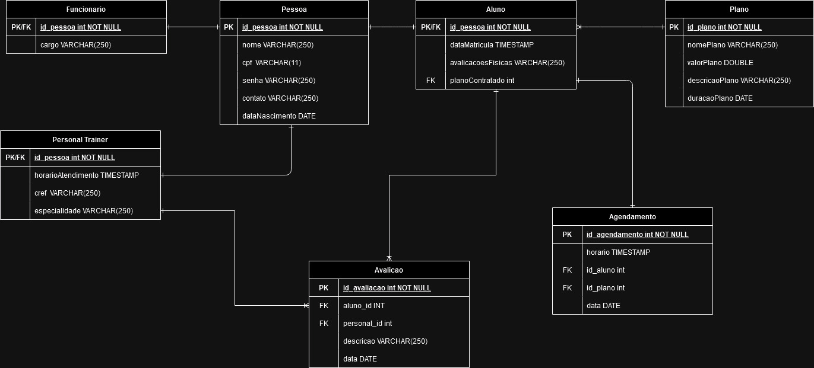

# Gerenciador de Alunos e Treinos 
Este programa é fruto de um trabalho em conjunto para a disciplina de Programação Orientada a Objetos da Residência em TIC/Software pelo programa de Residência SERRATEC. O mesmo é um simples gerenciador de academias, cuidando do gerenciamento dos alunos, seus professores particulares e os respectivos treinos.
O projeto é de código aberto e agradecemos qualquer melhoria ou refatoração do código para deixa-lo mais completo.

# A Estrutura do Projeto

# A Estrutura do Banco de Dados 

